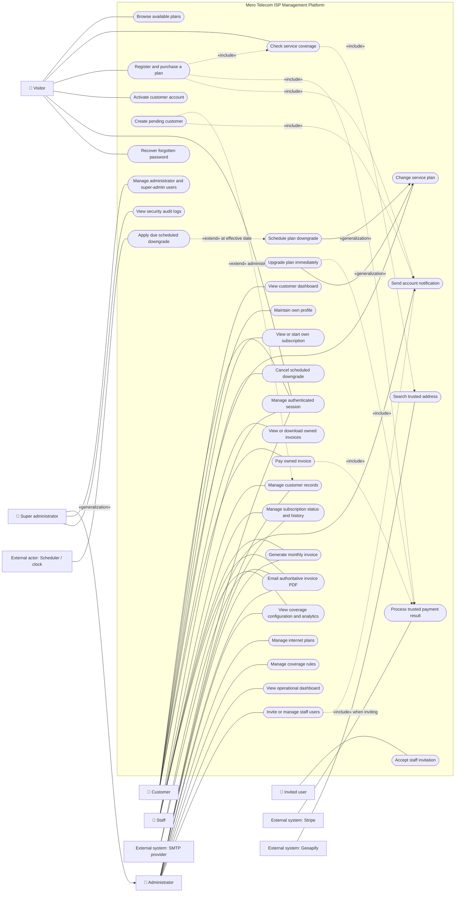
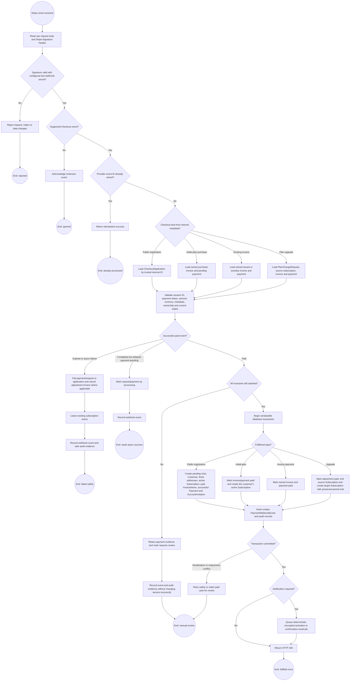
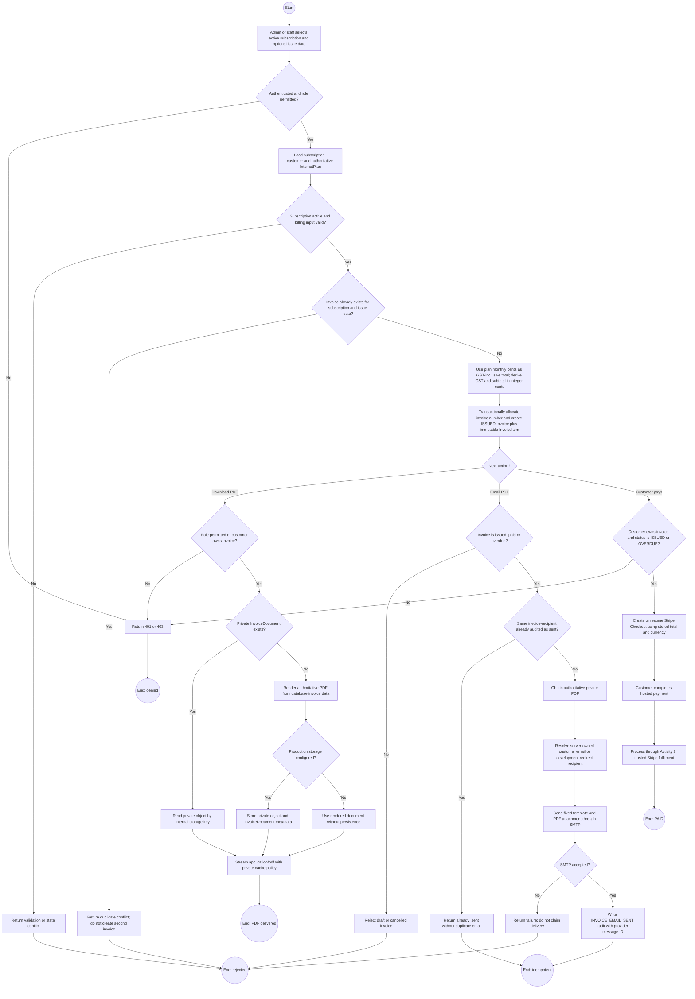
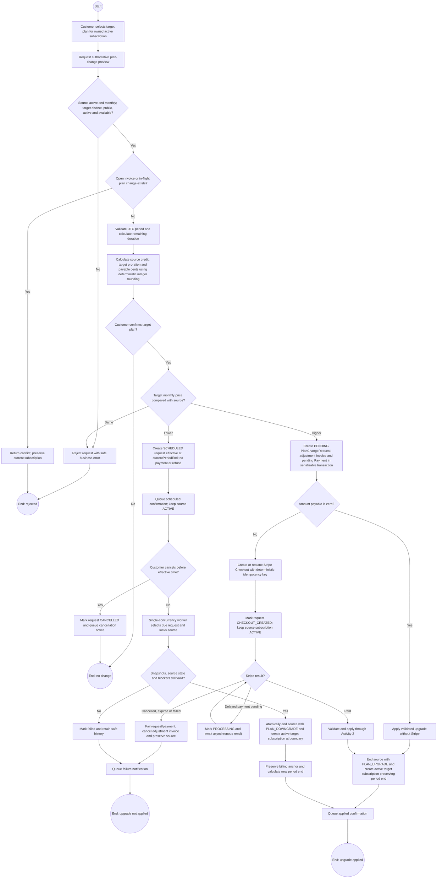
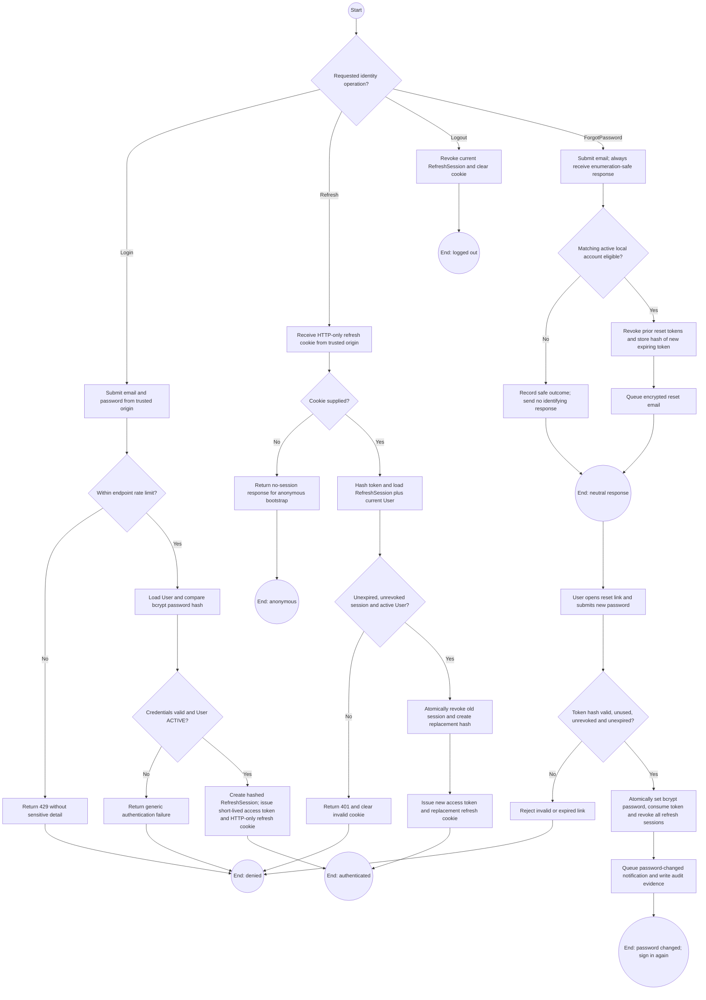
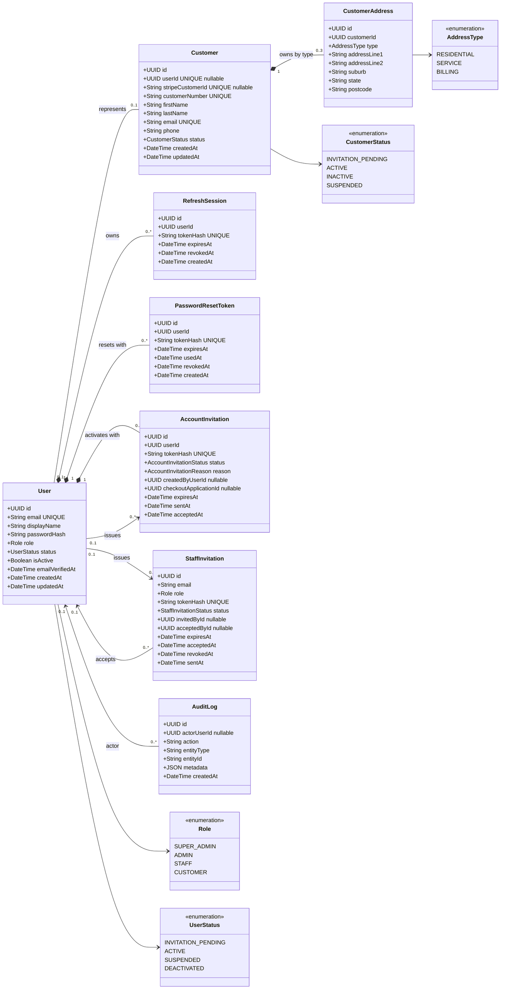
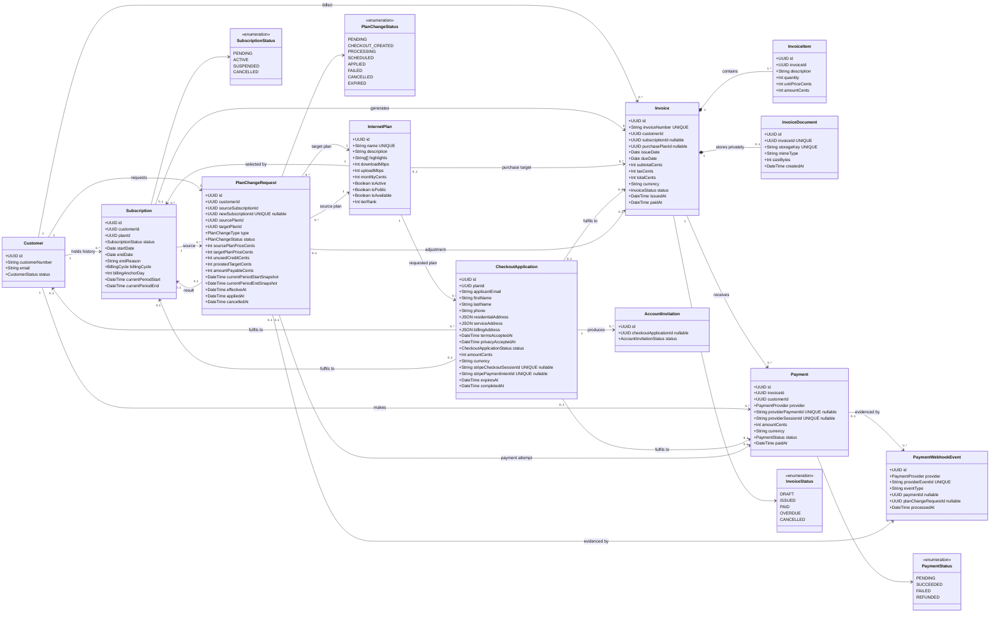
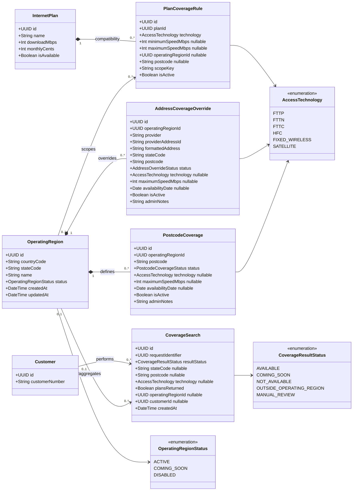

# Requirements UML diagrams

These diagrams translate the implemented Mero Telecom requirements into views intended for
business analysis and backend design. They describe the current system scope rather than future
network provisioning, production payments, credit checks, or accounting-platform integration.

## Use-case diagram

The rectangular system boundary contains goal-oriented use cases, while every human or external
system actor remains outside it. Plain lines are associations. `«include»` points from a base use
case to required reusable behaviour, `«extend»` points from conditional behaviour to the use case
it augments, and generalization points from a specialized actor or use case to its general form.
The notation follows the actor, oval use-case, system-boundary and relationship guidance in the
[GeeksforGeeks use-case diagram reference](https://www.geeksforgeeks.org/system-design/use-case-diagram/).

### Actor and permission interpretation

- A super administrator receives administrator capabilities through the backend authorization
  policy, then adds privileged-user and security-audit operations.
- An administrator may administer staff but may not manage another administrator or super
  administrator. A super administrator must have a recent password-authenticated session for
  sensitive super-administrator targets.
- A customer can act only on records resolved through their authenticated `User -> Customer`
  ownership mapping.
- Stripe redirects are informational. Only a signature-verified webhook or authenticated
  server-to-Stripe reconciliation can persist a successful payment transition.

## Activity diagrams

### Activity 1: Coverage qualification and new-customer purchase

This is the primary public acquisition flow. No login identity, customer, invoice, payment, or
subscription is created until Stripe reports a valid paid session.

```mermaid
flowchart TD
  Start((Start)) --> Browse["Visitor browses active, public, available plans"]
  Browse --> Enter["Enter service-address search text"]
  Enter --> Suggest["API requests normalized Geoapify suggestions"]
  Suggest --> Select{Trusted suggestion selected?}
  Select -- No --> Enter
  Select -- Yes --> StoreSelection["Store short-lived selection in Redis and return opaque token"]
  StoreSelection --> Check["Submit selected-address token for coverage check"]
  Check --> ConsumeSelection{Token exists, matches and is unused?}
  ConsumeSelection -- No --> InvalidSelection["Return expired or invalid selection; require new search"]
  InvalidSelection --> Enter
  ConsumeSelection -- Yes --> Region{Operating region active?}
  Region -- No --> Outside["Record privacy-safe search outcome and show outside-region result"]
  Outside --> StopUnavailable((End: unavailable))
  Region -- Yes --> Override{Active exact-address override exists?}
  Override -- Yes --> OverrideDecision["Use override as definitive decision"]
  Override -- No --> Postcode{Active exact-postcode rule exists?}
  Postcode -- No --> NotAvailable["Return not available"]
  Postcode -- Yes --> PostcodeDecision["Apply postcode status and technology"]
  OverrideDecision --> Orderable{Decision orderable?}
  PostcodeDecision --> Orderable
  Orderable -- No --> NonOrderable["Return unavailable, coming soon, or manual review"]
  NonOrderable --> StopUnavailable
  Orderable -- Yes --> Compatible["Filter plans using technology, speed, region and postcode rules"]
  Compatible --> AnyPlan{Selected plan compatible?}
  AnyPlan -- No --> ShowAlternatives["Show compatible plans"]
  ShowAlternatives --> Browse
  AnyPlan -- Yes --> Qualification["Issue one-use qualification token"]
  Qualification --> Context["Consume qualification; store trusted checkout context in Redis and HTTP-only cookie"]
  Context --> Form["Collect applicant contact details, consent and address relationship choices"]
  Form --> AddressChoice{Residential or billing address differs?}
  AddressChoice -- Yes --> ResolveMore["Resolve additional trusted one-use address selections"]
  AddressChoice -- No --> CopyTrusted["Copy trusted server-side address values"]
  ResolveMore --> Submit
  CopyTrusted --> Submit["Submit public plan-checkout request"]
  Submit --> ContextValid{Context present, unexpired, matched and unused?}
  ContextValid -- No --> Gone["Return 410; clear cookie and require fresh coverage check"]
  Gone --> Enter
  ContextValid -- Yes --> Requalify["Atomically consume context and re-run exact qualification"]
  Requalify --> ValidOrder{Plan still public, active, available and compatible?}
  ValidOrder -- No --> Reject["Reject order without creating business records"]
  Reject --> Browse
  ValidOrder -- Yes --> ExistingConflict{Existing identity or open application conflict?}
  ExistingConflict -- Yes --> Conflict["Return safe conflict or review outcome"]
  Conflict --> EndConflict((End: not submitted))
  ExistingConflict -- No --> Application["Create short-lived CheckoutApplication with trusted address snapshots and consent"]
  Application --> StripeSession["Create Stripe Checkout from database plan price"]
  StripeSession --> Redirect["Redirect visitor to Stripe-hosted Checkout"]
  Redirect --> Paid{Payment outcome?}
  Paid -- Cancelled, failed or expired --> NoCustomer["Mark application failed or expired; create no customer account"]
  NoCustomer --> EndFailed((End: unpaid))
  Paid -- Paid --> Webhook["Receive signed Stripe event or authenticated status reconciliation"]
  Webhook --> Verify["Continue through Activity 2: trusted payment fulfilment"]
  Verify --> EndPending((End: await activation))
```

### Activity 2: Trusted Stripe event and idempotent fulfilment

This flow is shared by public registration, an existing customer's first plan, an owned invoice
payment, and a paid upgrade.

### Activity 3: Monthly invoice generation, PDF delivery and payment

### Activity 4: Customer plan change

### Activity 5: Authentication, refresh rotation and password recovery

## Domain class diagrams

The complete domain is split into three bounded contexts so attributes and multiplicities remain
readable. These are conceptual/backend classes aligned with the Prisma model; DTOs, controllers,
guards, providers and framework classes are intentionally omitted.

### Identity and customer-management classes

Key constraints represented by this model:

- A customer may exist before login activation, but `Customer.userId` is unique when present.
- A customer has at most one address of each `AddressType`.
- Refresh, reset and invitation secrets are stored only as hashes and are independently expiring,
  revocable or consumable.
- User deactivation preserves business and audit records; it does not delete financial history.

### Plans, subscriptions, billing and payment classes

Important invariants:

- Prices and all derived totals are integer Australian cents; the browser never supplies an
  authoritative amount.
- Only one active subscription is allowed per customer, and old subscriptions remain as history
  after plan changes.
- One subscription and issue-date pair can produce only one monthly invoice.
- Provider event IDs, Checkout Session IDs and Payment Intent IDs are unique idempotency evidence.
- Public checkout records consent and trusted address snapshots before payment, but creates
  customer business records only after trusted paid fulfilment.

### Coverage-management classes

Coverage decisions use this precedence:

1. The selected provider address must be resolved from a valid server-issued token.
2. An inactive or unsupported operating region stops positive qualification.
3. An active exact-address override takes precedence over postcode coverage.
4. Otherwise, the active exact-postcode decision supplies availability, technology and maximum
   speed.
5. Active plan rules filter compatible plans by technology, speed and optional geographic scope.
6. `CoverageSearch` stores analytics outcomes without the raw address or client IP.

## Traceability to backend modules

| Requirement area        | Primary NestJS modules             | Authoritative classes                                       |
| ----------------------- | ---------------------------------- | ----------------------------------------------------------- |
| Identity and sessions   | Auth, System Users, Access Control | `User`, `RefreshSession`, `PasswordResetToken`, invitations |
| Customer operations     | Customers                          | `Customer`, `CustomerAddress`, `User`, `AccountInvitation`  |
| Coverage qualification  | Coverage                           | `OperatingRegion`, postcode/override/rule/search classes    |
| Plans and subscriptions | Plans, Subscriptions, Plan Changes | `InternetPlan`, `Subscription`, `PlanChangeRequest`         |
| Billing documents       | Billing, Invoices                  | `Invoice`, `InvoiceItem`, `InvoiceDocument`                 |
| Payment fulfilment      | Payments                           | `Payment`, `PaymentWebhookEvent`, `CheckoutApplication`     |
| Email side effects      | Notifications                      | Invitation/reset source records plus encrypted Redis jobs   |
| Operational reporting   | Dashboard, Cache                   | PostgreSQL aggregates and short-lived Redis cache           |
