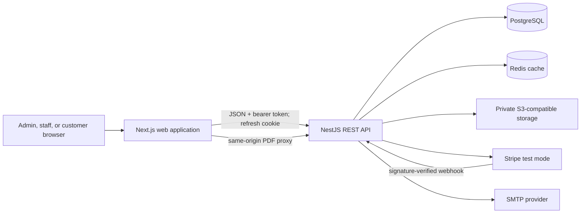
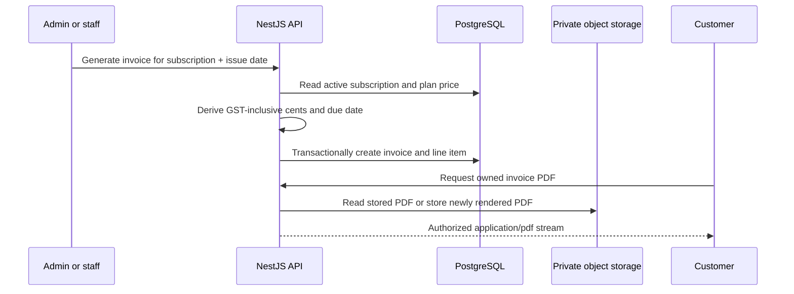

# System architecture

## Scope and boundaries

Mero Telecom is a deployable academic prototype for the administrative and customer-facing parts
of a small ISP. It is a modular monolith: one Next.js application presents the UI and one NestJS
application owns authentication, authorization, business rules, persistence, integrations, and
operational health. This keeps the capstone easy to reason about while retaining clear feature
module boundaries.

The web app never talks directly to PostgreSQL, Redis, Stripe, SMTP, or object storage. The PDF
route in Next.js is deliberately narrow: it forwards an authenticated download request and
streams the result, but it does not make authorization decisions or calculate invoice content.

## Backend modules

| Module        | Responsibility                                                                      |
| ------------- | ----------------------------------------------------------------------------------- |
| Auth          | Login, refresh rotation, logout/revocation, current identity, trusted-origin checks |
| Customers     | Customer CRUD, self-service profile, ownership-scoped reads                         |
| Plans         | Public active catalogue and admin lifecycle management                              |
| Subscriptions | Plan assignment, lifecycle updates, customer history                                |
| Invoices      | Billing calculation, invoice lifecycle, private PDFs, email delivery                |
| Payments      | Stripe Checkout and verified/idempotent webhook persistence                         |
| Dashboard     | Admin aggregates with Redis caching and customer-owned summary                      |
| Coverage      | Prototype postcode availability and eligible public plans                           |
| Health        | Process liveness plus PostgreSQL/Redis readiness                                    |

Cross-cutting components provide validation, exception normalization, RBAC, customer ownership,
rate limits, structured request logs, and administrative audit records.

## Authentication and session lifecycle

1. `POST /auth/login` verifies the bcrypt password hash.
2. The API returns a short-lived access token in JSON and sets a longer-lived, HTTP-only refresh
   cookie. The refresh token is stored only as a server-side hash.
3. The frontend keeps the access token in application memory and sends it as a bearer token.
4. `POST /auth/refresh` rotates the cookie and revokes the previous refresh session, preventing
   replay of the old token.
5. `POST /auth/logout` revokes the current refresh session and clears the cookie.

In production the refresh cookie is `Secure` and `SameSite=None`; the API accepts credentialed
CORS requests only from the configured frontend origin. Login, refresh, and logout also use a
trusted-origin guard. Short endpoint-specific limits protect login, refresh, and public coverage
in addition to the global throttle.

## Authorization model

NestJS guards are the security boundary. Route metadata defines allowed roles, and customer
ownership is checked against the database before protected records are returned. Query filters add
defence in depth by restricting customer reads to the authenticated `User -> Customer` mapping.

- `ADMIN`: full operational workflow, plan management, and invoice status changes.
- `STAFF`: customer updates and subscription/invoice operations; no plan lifecycle or arbitrary
  invoice status administration.
- `CUSTOMER`: their own profile, subscriptions, invoices, PDFs, dashboard, and payment initiation.

DTO validation rejects unknown fields, so self-service requests cannot mass-assign identity,
status, role, or billing fields. UI routing reflects these permissions but is not trusted for
enforcement.

## Billing and document flow

Money is stored and calculated in integer Australian cents. The plan price is authoritative; the
client never provides an invoice total. A unique subscription/issue-date constraint prevents
duplicate monthly invoices. Object keys and metadata are private database implementation details,
not public URLs.

## Stripe test-mode flow

The API accepts only Stripe test keys. A customer requests Checkout for an owned `ISSUED` or
`OVERDUE` invoice; the API sends the stored invoice total to Stripe and creates a pending payment
record. Browser success redirects are informational only. Payment succeeds only when the webhook
signature is valid and the event has not already been processed. The API then records the provider
identifiers and changes the invoice to `PAID` transactionally.

## Data, cache, and failure behaviour

PostgreSQL is the system of record. Redis caches only the admin dashboard summary with a short TTL;
a cache failure is logged and the API falls back to PostgreSQL. Readiness reports failure when
either PostgreSQL or Redis is unavailable so production traffic is not sent to an unhealthy
release. S3-compatible storage is mandatory in production because invoice documents must not rely
on an ephemeral filesystem.

## Security and observability

- Helmet headers, strict DTO validation, allowlisted credentialed CORS, and a production CSP.
- Structured JSON request logs contain request ID, method, path, status, duration, and user ID;
  request bodies, tokens, cookies, and secrets are excluded.
- Successful admin/staff mutations create audit records with actor, action, entity identifier, and
  safe request metadata.
- Secret-bearing integration settings are validated at startup and remain server-side.
- CI pins third-party actions by commit and runs formatting, lint, types, unit tests, database-backed
  end-to-end tests, builds, Prisma validation, and a high-severity dependency audit.

## Deployment architecture

The prepared production target is Vercel (`apps/web`) plus a Render Blueprint (API, private
PostgreSQL, and private Redis) in Singapore. A private S3-compatible bucket, SMTP account, and
Stripe test-mode webhook are external prerequisites. Provider provisioning and smoke tests are
defined in [the deployment runbook](../deployment.md).
