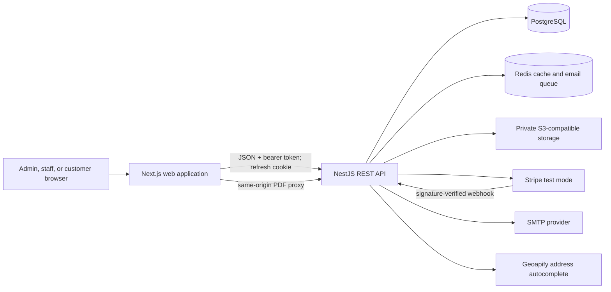
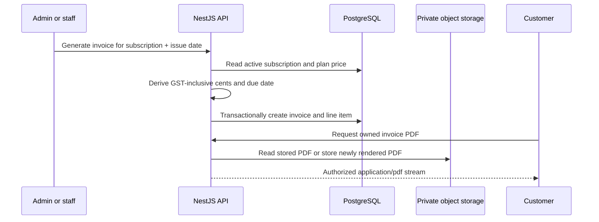

# System architecture

## Scope and boundaries

Mero Telecom is a deployable academic prototype for the administrative and customer-facing parts
of a small ISP. It is a modular monolith: one Next.js application presents the UI and one NestJS
application owns authentication, authorization, business rules, persistence, integrations, and
operational health. This keeps the capstone easy to reason about while retaining clear feature
module boundaries.

The web app never talks directly to PostgreSQL, Redis, Stripe, SMTP, or object storage. The PDF
route in Next.js is deliberately narrow: it forwards an authenticated download request and
streams the result, but it does not make authorization decisions or calculate invoice content.

## Backend modules

| Module        | Responsibility                                                                      |
| ------------- | ----------------------------------------------------------------------------------- |
| Auth          | Login, refresh rotation, logout/revocation, current identity, trusted-origin checks |
| Customers     | Customer CRUD, self-service profile, ownership-scoped reads                         |
| Plans         | Public active catalogue and admin lifecycle management                              |
| Subscriptions | Payment-activated service lifecycle and customer history                            |
| Invoices      | Billing calculation, invoice lifecycle, private PDFs, email delivery                |
| Payments      | Stripe Checkout and verified/idempotent webhook persistence                         |
| Notifications | Encrypted BullMQ jobs, SMTP templates, retries, and auditable delivery outcomes     |
| Dashboard     | Admin aggregates with Redis caching and customer-owned summary                      |
| Coverage      | Trusted address selection, exact DB qualification, plan compatibility, operations   |
| Health        | Process liveness plus PostgreSQL/Redis readiness                                    |

Cross-cutting components provide validation, exception normalization, RBAC, customer ownership,
rate limits, structured request logs, and administrative audit records.

## Authentication and session lifecycle

1. Admin-created and paid-public customers begin as `INVITATION_PENDING` with no password. A
   random activation token is hashed in PostgreSQL and queued in an encrypted email payload.
2. `POST /auth/activation` atomically consumes a valid, unexpired, single-use token, stores the
   customer-chosen bcrypt password, verifies the email, and activates the user/customer.
3. `POST /auth/login` verifies the bcrypt password hash and requires an `ACTIVE` user.
4. The API returns a short-lived access token in JSON and sets a longer-lived, HTTP-only refresh
   cookie. The refresh token is stored only as a server-side hash.
5. The frontend keeps the access token in application memory and sends it as a bearer token.
6. `POST /auth/refresh` rotates the cookie and revokes the previous refresh session, preventing
   replay of the old token.
7. `POST /auth/logout` revokes the current refresh session and clears the cookie.
8. `POST /auth/forgot-password` always returns the same acknowledgement. For an eligible account,
   it stores only a SHA-256 hash of a 32-byte random token and queues a 30-minute reset URL.
9. `POST /auth/reset-password` atomically consumes that token, replaces the bcrypt password hash,
   revokes every refresh session and other reset token, and queues a password-changed warning.
   The transaction never updates role, account status, or `isActive`.

In production the refresh cookie is `Secure` and `SameSite=None`; the API accepts credentialed
CORS requests only from the configured frontend origin. Login, refresh, and logout also use a
trusted-origin guard. Short endpoint-specific limits protect login, refresh, and public coverage
in addition to the global throttle.

## Email delivery lifecycle

Account invitations, password recovery/security messages, and paid-subscription confirmations use BullMQ on Redis. Business operations
enqueue a deterministic job and return without waiting for Gmail or another SMTP provider. The
worker decrypts the job in memory, rejects revoked or expired invitations/reset tokens, and calls the existing
Nodemailer adapter. Temporary failures are retried with configurable exponential backoff. A final
success or failure creates safe audit evidence without logging recipients, message bodies,
activation URLs, or credentials; `AccountInvitation.sentAt` is set only after SMTP accepts the
message.

Queue payloads use AES-256-GCM. Production requires an independent
`EMAIL_QUEUE_ENCRYPTION_KEY`; development derives a key from the refresh-token secret when the
dedicated key is omitted. Completed jobs are retained briefly for operations, failed jobs are kept
longer for diagnosis, and all retained job data remains encrypted. Manual invoice PDF email stays
synchronous because the endpoint promises an immediate sent/already-sent result and stores the
provider message ID.

This design adapts the queue/retry/template/observability principles from
[Building a Scalable Email Service with Node.js](https://blog.devgenius.io/building-a-scalable-email-service-with-node-js-the-complete-guide-fcebf3f0ed3d)
to the existing NestJS modules, BullMQ, security requirements, and audit model.

## Authorization model

NestJS guards are the security boundary. Route metadata defines allowed roles, and customer
ownership is checked against the database before protected records are returned. Query filters add
defence in depth by restricting customer reads to the authenticated `User -> Customer` mapping.

- `ADMIN`: full operational workflow, plan/coverage management, and invoice status changes.
- `STAFF`: customer updates, subscription/invoice operations, coverage lookup, and read-only
  coverage configuration; no region/plan-rule mutations or arbitrary invoice administration.
- `CUSTOMER`: their own profile, subscriptions, invoices, PDFs, dashboard, and payment initiation.

DTO validation rejects unknown fields, so self-service requests cannot mass-assign identity,
status, role, or billing fields. UI routing reflects these permissions but is not trusted for
enforcement.

## Billing and document flow

Money is stored and calculated in integer Australian cents. The plan price is authoritative; the
client never provides an invoice total. A unique subscription/issue-date constraint prevents
duplicate monthly invoices. Object keys and metadata are private database implementation details,
not public URLs.

## Stripe test-mode flow

The API accepts only Stripe test keys. A visitor can qualify a trusted service address, select a
compatible public plan, and open Checkout without creating an account. Redis holds a short-lived
qualification record behind an opaque HTTP-only cookie, so the browser never posts authoritative
address fields. Checkout may resolve distinct residential and billing selections, revalidates the
service address/plan, and uses only the stored plan price. A verified paid event creates the
customer, three normalized address roles, nullable-password login identity, active subscription,
paid invoice/payment, and activation invitation atomically. Failed or abandoned sessions never
reserve a login identity.

An authenticated customer can also select an active plan; the API creates an
initial invoice from the server-side plan price and opens Stripe Checkout without creating a
subscription. Browser success redirects are informational only. When a signature-verified,
idempotent paid event arrives, one transaction records the payment, changes the invoice to `PAID`,
creates the `ACTIVE` subscription, and links the invoice to it. A partial unique index permits only
one unpaid plan purchase per customer, preventing two simultaneous Checkouts from producing two
paid selections. Existing subscription invoices continue through the owned `ISSUED`/`OVERDUE`
invoice Checkout flow.

Plan upgrades extend that same verified Checkout boundary with a one-time, integer-cent prorated
charge. The old subscription remains active until the paid webhook atomically creates a historical
transition and a new active subscription with the preserved period end. Downgrades require no
payment and are reconciled at the stored UTC billing boundary by a single-concurrency BullMQ worker.
The worker also advances expired monthly periods with stable month-end anchors. See
[subscription plan changes](../api/plan-changes.md).

## Data, cache, and failure behaviour

PostgreSQL is the system of record. Redis caches the admin dashboard summary and normalized
autocomplete queries, stores short-lived one-time address selections, and persists the encrypted
email queue. It also stores one-use coverage qualifications and guest checkout contexts; those
contexts contain the trusted service address and compatible plan scope while the browser holds
only a random HTTP-only identifier. Dashboard cache reads can fall back to PostgreSQL; trusted
address/checkout verification and queue writes fail closed because neither can safely accept an
unverified fallback. Readiness
reports failure when PostgreSQL or Redis is unavailable. S3-compatible storage is mandatory in
production because invoice documents must not rely on an ephemeral filesystem.

PostgreSQL also owns explicit system roles, including `SUPER_ADMIN`; role ordering is never used.
Local authentication is currently authoritative and Authentik/MFA is not integrated. Staff,
administrators, and super administrators enter through hashed, expiring, single-use invitations,
while public creation always produces a customer. Every protected request reloads current role and
account state, privileged changes revoke refresh sessions, and super-admin target changes require a
recent signed password-login timestamp. See
[system-user provisioning](../api/system-users.md).

## Security and observability

- Helmet headers, strict DTO validation, allowlisted credentialed CORS, and a production CSP.
- Structured JSON request logs contain request ID, method, path, status, duration, and user ID;
  request bodies, tokens, cookies, and secrets are excluded.
- Successful admin/staff mutations create audit records with actor, action, entity identifier, and
  safe request metadata.
- Secret-bearing integration settings are validated at startup and remain server-side.
- CI pins third-party actions by commit and runs formatting, lint, types, unit tests, database-backed
  end-to-end tests, builds, Prisma validation, and a high-severity dependency audit.

## Deployment architecture

The prepared production target is Vercel (`apps/web`) plus a Render Blueprint (API, private
PostgreSQL, and private Redis) in Singapore. A private S3-compatible bucket, SMTP account, and
Stripe test-mode webhook are external prerequisites. Provider provisioning and smoke tests are
defined in [the deployment runbook](../deployment.md).
