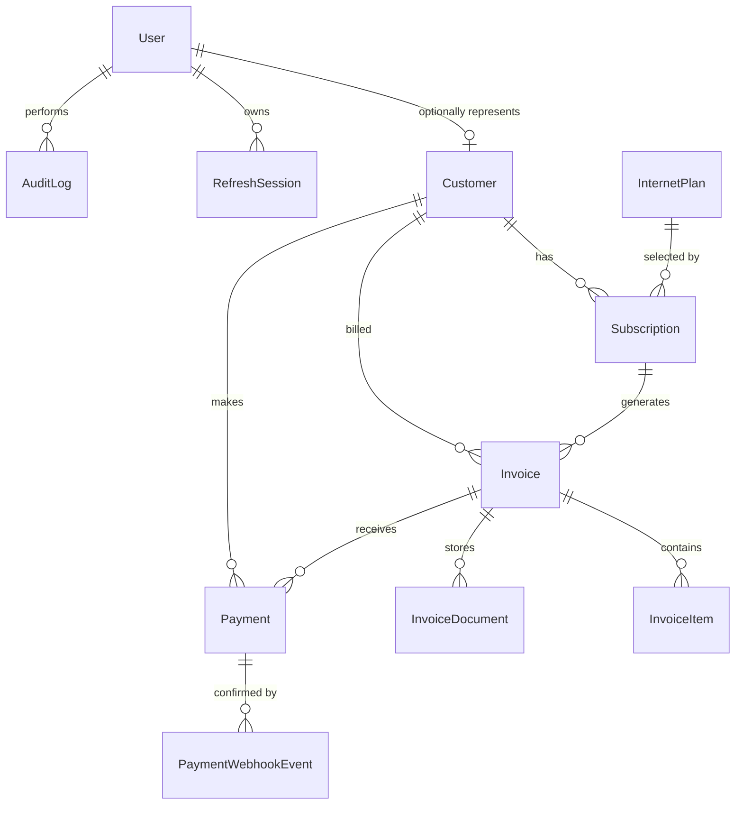

# Database design and ERD

PostgreSQL is the authoritative datastore and Prisma migrations are the only supported schema
change mechanism. Money is stored as integer Australian cents (`6900` means AUD 69.00), avoiding
floating-point errors during invoice and GST calculations.

## Entity responsibilities

| Entity                | Purpose and important constraints                                             |
| --------------------- | ----------------------------------------------------------------------------- |
| `User`                | Login identity; unique email, bcrypt password hash, role, active flag         |
| `Customer`            | CRM and service address; unique number/email and optional unique user mapping |
| `InternetPlan`        | Speed and GST-inclusive monthly cents; deactivation preserves history         |
| `Subscription`        | Customer-to-plan history and lifecycle; restrictive foreign keys              |
| `Invoice`             | Authoritative totals/status; unique number and subscription/issue-date pair   |
| `InvoiceItem`         | Immutable billing description, quantity, unit cents, and amount cents         |
| `InvoiceDocument`     | Private object key, MIME type, size, and one-record-per-invoice constraint    |
| `Payment`             | Provider/session identifiers, amount, state, and customer/invoice ownership   |
| `PaymentWebhookEvent` | Unique provider event ID for idempotent webhook processing                    |
| `RefreshSession`      | Unique hash of a refresh token, expiry, and revocation timestamp              |
| `AuditLog`            | Actor, action, entity reference, safe metadata, and creation timestamp        |

## Relationship and deletion decisions

- `Customer.userId` is optional and unique so an operational record may exist before a login is
  provisioned, while one customer identity cannot represent multiple records.
- Customer, plan, subscription, invoice, and payment relationships use restrictive deletes to
  preserve financial history.
- Deleting an invoice explicitly cascades only to its line items and private document metadata.
  The associated object must be managed by the storage lifecycle policy; normal application flows
  cancel invoices rather than deleting them.
- Deleting a user cascades its refresh sessions and sets customer/audit actor references to null,
  preserving business and audit history.
- Payment webhook events retain provider-event uniqueness and set their optional payment reference
  to null if needed, preventing replay even when a relationship changes.

## Indexing and invariants

- Customer name/status, subscription customer/status, invoice customer/status and due-date/status,
  payment ownership/status, refresh expiry, audit actor/time, and document creation time are
  indexed for expected query paths.
- Database uniqueness complements service validation for emails, customer/invoice numbers,
  provider identifiers, webhook events, refresh hashes, and monthly invoices.
- Invoice and payment state changes use transactions where multiple records must remain consistent.
- `Invoice.pdfUrl` is retained for migration compatibility but new private documents use
  `InvoiceDocument`; no application flow publishes this legacy field.

## Migration operations

Development may create migrations with `prisma migrate dev`. CI and production apply committed,
forward-only migrations with `prisma migrate deploy`. The development seed is repeatable but must
never be run against production data.
