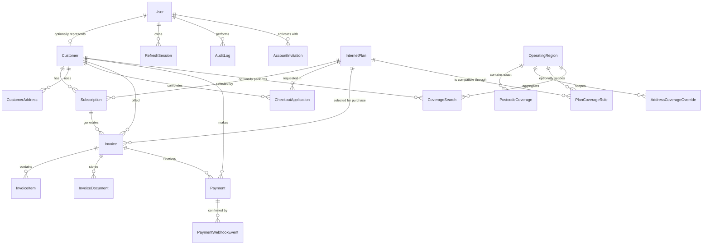

# Database design and ERD

PostgreSQL is the authoritative datastore and Prisma migrations are the only supported schema
change mechanism. Money is stored as integer Australian cents (`6900` means AUD 69.00), avoiding
floating-point errors during invoice and GST calculations.

## Entity responsibilities

| Entity                    | Purpose and important constraints                                              |
| ------------------------- | ------------------------------------------------------------------------------ |
| `User`                    | Login identity; nullable password until invitation activation; explicit state  |
| `Customer`                | CRM and service address; unique number/email and optional unique user mapping  |
| `CustomerAddress`         | Typed residential, service, and billing addresses                              |
| `AccountInvitation`       | Hashed, expiring, single-use activation token and delivery lifecycle           |
| `CheckoutApplication`     | Pre-payment applicant/consent snapshot and Stripe reconciliation state         |
| `InternetPlan`            | Speed and GST-inclusive monthly cents; deactivation preserves history          |
| `Subscription`            | Customer-to-plan history, explicit UTC billing period, and lifecycle           |
| `PlanChangeRequest`       | Source/target snapshots, proration, Stripe state, scheduling, and traceability |
| `Invoice`                 | Authoritative totals/status; subscription billing or an initial plan purchase  |
| `InvoiceItem`             | Immutable billing description, quantity, unit cents, and amount cents          |
| `InvoiceDocument`         | Private object key, MIME type, size, and one-record-per-invoice constraint     |
| `Payment`                 | Provider/session identifiers, amount, state, and customer/invoice ownership    |
| `PaymentWebhookEvent`     | Unique provider event ID for idempotent webhook processing                     |
| `RefreshSession`          | Unique hash of a refresh token, expiry, and revocation timestamp               |
| `AuditLog`                | Actor, action, entity reference, safe metadata, and creation timestamp         |
| `OperatingRegion`         | Configurable AU state lifecycle; only SA starts active                         |
| `PostcodeCoverage`        | One preliminary decision for an exact regional four-digit postcode             |
| `AddressCoverageOverride` | Definitive provider-address exception that precedes postcode rules             |
| `PlanCoverageRule`        | Technology/speed compatibility with optional region/postcode scope             |
| `CoverageSearch`          | Privacy-safe outcome analytics without raw address or IP                       |

## Relationship and deletion decisions

- `Customer.userId` is optional and unique so an operational record may exist before a login is
  provisioned, while one customer identity cannot represent multiple records.
- Customer, plan, subscription, invoice, and payment relationships use restrictive deletes to
  preserve financial history.
- Deleting an invoice explicitly cascades only to its line items and private document metadata.
  The associated object must be managed by the storage lifecycle policy; normal application flows
  cancel invoices rather than deleting them.
- Deleting a user cascades its refresh sessions and sets customer/audit actor references to null,
  preserving business and audit history.
- Payment webhook events retain provider-event uniqueness and set their optional payment reference
  to null if needed, preventing replay even when a relationship changes.

## Indexing and invariants

- Customer name/status, subscription customer/status, invoice customer/status and due-date/status,
  payment ownership/status, refresh expiry, audit actor/time, and document creation time are
  indexed for expected query paths.
- Database uniqueness complements service validation for emails, customer/invoice numbers,
  provider identifiers, webhook events, refresh hashes, and monthly invoices.
- A partial unique index permits only one open public checkout application per normalized email,
  without letting failed or abandoned attempts permanently reserve it.
- Invitation token hashes are unique. Transactional conditional updates prevent two requests from
  consuming the same token.
- A partial unique index permits only one issued/overdue plan-purchase invoice per customer.
- A partial unique index permits only one active plan-change request per source subscription;
  unique links prevent reuse of a Checkout session, Payment Intent, invoice, payment, or resulting
  subscription across requests.
- Invoice and payment state changes use transactions where multiple records must remain consistent.
- `Invoice.pdfUrl` is retained for migration compatibility but new private documents use
  `InvoiceDocument`; no application flow publishes this legacy field.
- Region/postcode and provider/address uniqueness reject duplicate qualification records. Plan,
  technology, and normalized scope uniqueness rejects duplicate compatibility rules.

## Migration operations

Development may create migrations with `prisma migrate dev`. CI and production apply committed,
forward-only migrations with `prisma migrate deploy`. The development seed is repeatable but must
never be run against production data.
