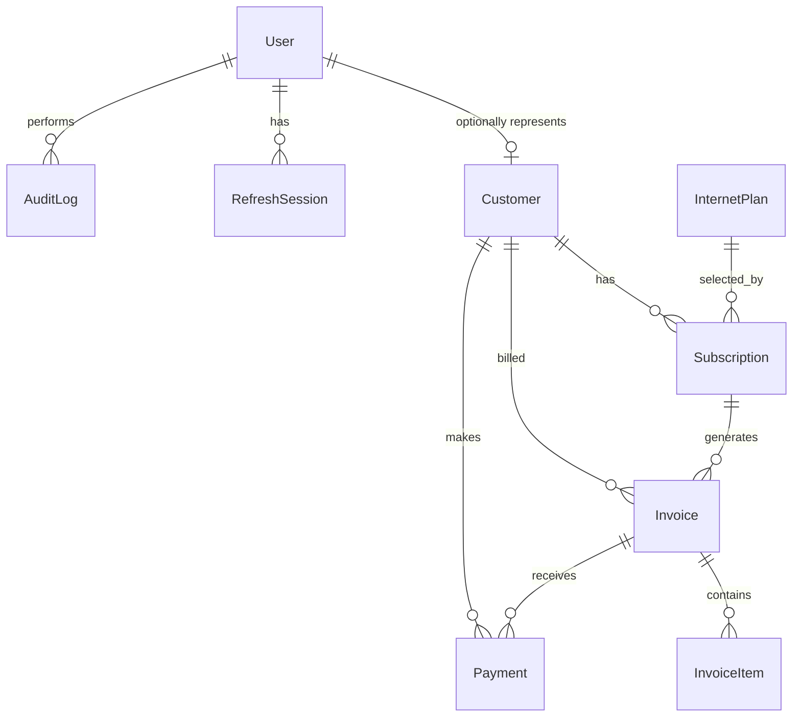

# Initial database design

Phase 2 introduces PostgreSQL through Prisma. Monetary values are stored in integer Australian
cent amounts (`6900` represents AUD 69.00), so invoice arithmetic remains deterministic.

## Key decisions

- `Customer.userId` is optional and unique: a customer record can exist before a customer login is
  provisioned, while a customer user can represent only one customer.
- Subscription history is preserved rather than storing a plan directly on a customer.
- Invoice and payment totals use integer cents and ISO currency codes, with AUD as the default.
- Refresh tokens are represented only by a unique server-side hash; plaintext tokens are never
  stored.
- Customer, plan, and subscription records use restrictive foreign keys to preserve billing
  history. Invoice items are deleted only if their parent invoice is explicitly deleted.
